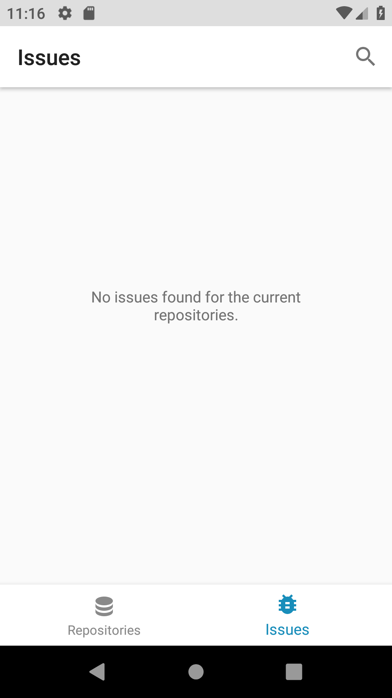

This project is an attempt at a clean code architecture with testability and scalability in mind. It utilizes Dagger2, RxJava, MVVM with some Architecture Components (Room, ViewModel, LiveData), Retrofit, etc.

The app allows users to search for and save Github repositories in their library so that they can then browse and search the Github Issues of these repositories. This is done using the Github API v3 without user authentication. 

One main issue with not being authenticated with this app is Github's rate limits. We can easily hit the limits after using the application intensely for a short while. Introducing caching with OkHttp helped the rate limiting greatly with reducing wasted calls. If this project was to be released on the Play Store or elsewhere, it would be wise to add user authentication to remove these issues.

This is just a pet project of mine. I would not deem this app ready for release at this point.  

## Information & Architecture

In this section you'll find details on the projects dependencies, architecture/structure as well as my assumptions, decisions and reasoning behind it all.

### Dependencies

Here are the dependencies included in the app and their reasoning:
+ **Android support + design libraries**: Included to get access to backwards compatible, modern UI components
+ **ViewModel + LiveData architecture components**: Included to take advantage of lifecycle aware classes and mechanism that facilitates updating our views.
+ **Room architecture component**: Included as our persistence library to make our SQLite database management much more enjoyable and simple.
+ **RxJava, RxAndroid**: Included to benefit from reactive streams and operators. Especially to allow the combination of multiple endpoint responses.
+ **RecyclerView Animators**: Included to add nice loading and adding/removing item animations to recyclerview (list ui).
+ **OkHttp**: Included to customize our HTTP client used with Retrofit.
+ **Retrofit**: Included to serve as the HTTP client for the app. Facilitates defining our API interface and getting the JSON responses converted directly to POJOs or Kotlin data classes.
+ **Gson (through retrofit)**: Included as our conversion library to have our JSON responses converted into our data objects.
+ **Dagger 2**: Included to provide proper dependency injection and help with testability.
+ **Glide**: Included to provide clean image loading and caching in the app.
+ **JUnit**: Included as our main testing tool.
+ **MockK**: Included as our object mocking and verification testing tool.
+ **Espresso**: Included as our main UI testing tool. 

### Structure

The project is split into 5 distinct modules. By having multiple modules we gain advantages such as reduced build time due to building modules in parallel as well as a clearer/cleaner separation between layers. Our 5 modules serve different purposes:
+ **app**: Contains all of our view related classes and files (views, adapters, viewModels, activities/fragments), our android application files (manifest, resources) as well as our dependency injection wiring.
+ **domain**: Contains our main data models (ones with pertinent variables), our repository interface definition and our usecases that contain all core "business" logic.
+ **repository**: Our central abstraction to our data. Implements the repository interface defined in the domain layer and manages our data sources. This layer also contains our pagination logic in the current design.
+ **database**: Contains classes and files for our local/offline SQLite database. 
+ **api**: Contains classes and files for our remote/online REST api connection (Github api).

### Presentation/UI/UX

The **/extras/** folder in the branch contains all these screenshots as well as two videos showcasing/demo-ing the application. Here's a quick rundown of the application's 5 different screens:

**Repository List** (RepositoryListFragment) - The first screen that opens when the app is launched and is one of the two main screens (hosted by MainActivity). This screen displays all of the user's currently saved/tracked repositories.

**Issue List** (IssueListFragment) - This screen is the second of the two main screens (hosted by MainActivity). This screen displays all of the issues pertaining to the user's currently saved/tracked repositories. This screen also contains a search function in the toolbar to search the issues.

**Repository Search** (RepositorySearchActivity) - This screen is accessed from the floating action button present on the repository list screen. This screen enables searching Github for repositories and displays search result in a recyclerview list. If a repository is already saved by the user, a green checkmark will appear in it's cardview.

**Repository Detail** (RepositoryDetailActivity) - This screen is accessed by clicking on any repository, either from the repository list screen or from the repository search screen. This screen displays the repository github page within a contained webview. The toolbar also contains buttons to either SAVE the repository to the user's list or to REMOVE it if it's already been added before.

**Issue Detail** (IssueDetailActivity) - This screen is accessed by clicking on any issue within the issue list screen. This screen displays the issue github page within a contained webview.

The whole app is very clean and light. Inspired by Google's latest material design 2 re-design with white/gray/black as the base colors and using other colors to emphasize certain components.

All the list UIs have animations to load items as you scroll or if you remove items (Repository List screen). Animations for the toolbar and/or floating action button were also included to increase the visibility of the lists as you scroll through. Pull to refresh is also included since it's still an intuitive UX component.

### MVVM

The project uses the MVVM pattern to handle updating the UI and receiving user events. This is combined with android databinding (the list ViewHolders are good examples of the databinding in action). The ViewModel is basically reacting to user events and posting data/events/results to LiveData objects, completely unaware of the view itself. The view (fragment/activity) subscribes to user triggered events and calls the ViewModel appropriately. It also subscribes to the LiveData objects from the ViewModel to updated the UI accordingly.

### Error handling

The error handling in the app is very basic. The api returns an error through Rx if a call fails in any way and all errors are propagated through the chain to the ViewModel that displays a generic error dialog.

### Dependency Injection

The project uses Dagger (2) by Google ("A fast dependency injector for Android and Java.") to provide dependency injection.  Dagger is compile-time dependency injection library that utilizes code generation to build a dependency graph. It makes wiring our dependencies a breeze while maintaining great performance.

Most of the injections are done with constructor injection (@Inject constructor(...)) unless we need to provide an interface implementation or provide a dependency through a builder.

By building the project from the ground up with Dagger it's made every single class testable.

### Business logic

For pagination, since configured dagger to provide the same instance of the data repository (singleton pattern), I was able to store the next page details in memory in the class. Single calls and searches are simple, but getting all repository issues and searching them is a bit more involved. I used a Map to store github repo name key and next page info value in pairs so I could look them up at every call to see what page to use.

For data flow, I leveraged the operators of Rx to map() and flatMap() my chained calls. I iterate over locally saved/tracked repositories and get/search issues for each one and then combine the outputs together and flatten them into a single list that's sorted by date last updated.

### Testing

The project currently has unit tests spread across most modules (not 100% coverage). These tests are written using mock inputs to create a controlled environment and have predictable outcomes. Tests generally stick to a single assertion each (some exceptions). We construct a new subject under test (SUT) @Before every test with our mock dependencies. Mocking the dependencies allows us to stub it's public methods and provide our desired return.

I started the project by writing tests alongside regular code but I didn't keep it going through the whole project (thus the lack of coverage).

No UI/Integration tests are currently written for the project.
 
